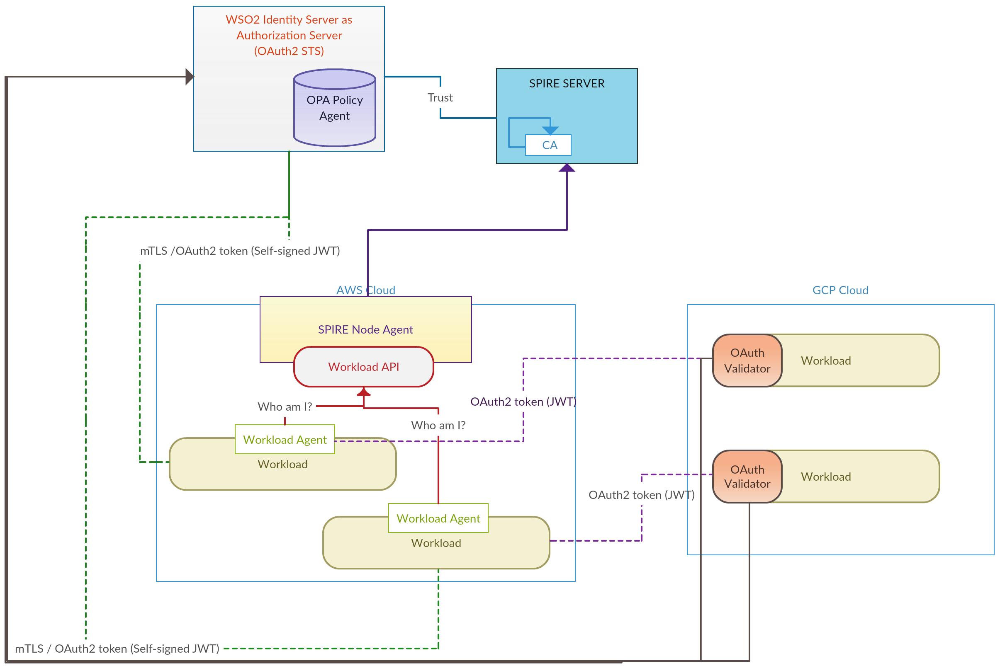

# SPIFFE based KeyStore/TrustStore and OAuth2.0 with WSO2 IS Authorization Server

This demo shows an example using a SPIFFE based KeyStore implemented in the [JAVA-SPIFFE library](https://github.com/spiffe/java-spiffe)
to authenticate workloads and then to authorize those workloads under OAuth 2.0 protocol. This extends the 
[tomcat demo hosted by SPIFEE community](https://github.com/spiffe/spiffe-example/tree/master/java-keystore-tomcat-demo) demonstrated authentication
to be used in OAuth 2.0 MTLS based client authentication to be integrated with the OAuth2.0 based systems.

The SPIFFE KeyStore interacts with the Workload API to fetch asynchronously the SVIDs and handle the certificates in memory. Certificates
updates are pushed by the Workload API before expiration.  

mTLS connections are handled by the Tomcat, that has a connector configured to use a `Spiffe` KeyStoreType. As WSO2 IS also based on tomcat, 
this is used as it is.

One of the Tomcats is configured with a [Java Servlet Filter](../spiffe-tomcat-filter) to grant access to APIs based on the SPIFFE ID of the client. 

It also demonstrates that a standalone Java Application can use the SPIFFE Provider and interact with both a Java App 
running on Tomcat and a SPIFFE Nginx. 

This demo is based on SPIRE version 0.6.0.

## Demo scenario 

### Components

This demo is composed of 4 containers as seen in the following diagram:



WSO2 IS has a connector configured to listen on port 9443, to connect with mTLS, using the custom KeyStoreType `Spiffe`.
That KeyStore connects with the Workload API to receive automatically the SVID updates that are used during the handshake
when establishing a TLS connection. It also validates the Peer's SPIFFE ID. 

Tomcat connector: 

```
<Connector
            protocol="org.apache.coyote.http11.Http11NioProtocol"
            port="8443" maxThreads="200"
            scheme="https" secure="true" SSLEnabled="true"
            keystoreFile="" keystorePass=""
            keystoreType="Spiffe"
            clientAuth="true" sslProtocol="TLS"/>
```

The trusted SPIFFE ID is configured in the `java.security` file through the `ssl.spiffe.accept`. In the Backend it looks as follows: 

```
ssl.spiffe.accept=spiffe://example.org/front-end
```

The _Standalone Java App_ in the diagram is a simple cURL app that takes an URL as a parameter and connects over mTLS using 
the SPIFFE Provider. It's used to access an `API` running on the _Backend_ Tomcat and to get data from `Users Service` connecting
to the NGINX Proxy. 

The following diagram shows a simplified version of the workloads only, with their SPIFFE IDs and the interactions between
each other: 


The `WEB-APP` that gets the SPIFFE ID `spiffe://example.org/front-end1` is allowed to access the API `/tasks` on the Backend, 
whereas `SSL-CURL-JAVA` that gets the SPIFFE ID `spiffe://example.org/front-end2` is allowed to access the API `/projects`. 
That is configured through the file `<tomcat>/conf/web.xml`: 

```
    <filter>
        <filter-name>SpiffeFilter1</filter-name>
        <filter-class>spiffe.filter.SpiffeFilter</filter-class>
        <init-param>
            <param-name>accept-spiffe-id</param-name>
            <param-value>spiffe://example.org/front-end1</param-value>
        </init-param>
    </filter>

    <filter-mapping>
        <filter-name>SpiffeFilter1</filter-name>
        <url-pattern>/tasks/*</url-pattern>
    </filter-mapping>

    <filter>
        <filter-name>SpiffeFilter2</filter-name>
        <filter-class>spiffe.filter.SpiffeFilter</filter-class>
        <init-param>
            <param-name>accept-spiffe-id</param-name>
            <param-value>spiffe://example.org/front-end2</param-value>
        </init-param>
    </filter>

    <filter-mapping>
        <filter-name>SpiffeFilter2</filter-name>
        <url-pattern>/projects/*</url-pattern>
    </filter-mapping>
```

`SpiffeFilter` is a simple _Java Servlet Filter_ example to show how SPIFFE ID based filtering to multiple APIs can be implemented. 
The code is available in this [repo](../spiffe-tomcat-filter). 

#### Registration Entries

| Workload        | Selector      | SPIFFE ID                           | Parent ID                  |
| ----------------| --------------|-------------------------------------| ---------------------------|
| Back-end        | unix:uid:1000 | spiffe://example.org/back-end       | spiffe://example.org/host1 |
| Front-end 1     | unix:uid:1000 | spiffe://example.org/front-end1     | spiffe://example.org/host2 | 
| Front-end 2     | unix:uid:1001 | spiffe://example.org/front-end2     | spiffe://example.org/host2 | 
| Proxy-Service   | unix:uid:1000 | spiffe://example.org/proxy-service  | spiffe://example.org/host3 | 
| WSO2-IS         | unix:uid:1002 | spiffe://example.org/wso2-is        | spiffe://example.org/host4 |

### Run the demo

##### Prerequisites

- Linux or macOS
- [Docker](https://docs.docker.com/install/)
- [Docker Compose](https://docs.docker.com/compose/install/)

##### 1. Clone this repo

##### 2. Build and run the docker containers

```
$ make build

Successfully built
```

Run the containers:

```
$ make run

docker-compose up -d
Creating network "spiffeenvoydemo_default" with the default driver
Creating spiffeenvoydemo_spire-server_1 ...
Creating spiffeenvoydemo_spire-server_1 ... done
Creating spiffeenvoydemo_backend_1 ...
Creating javakeystoretomcatdemo_users-service_1
Creating javakeystoretomcatdemo_users-service_1 ... done
Creating spiffeenvoydemo_backend_1 ... done
Creating spiffeenvoydemo_frontend_1 ...
Creating spiffeenvoydemo_frontend_1 ... done
```

##### 4. Run the SPIRE Server 

On a console run:

```
$ docker-compose exec spire-server ./spire-server run 

INFO[0000] plugins started
INFO[0000] Starting gRPC server                          subsystem_name=endpoints
INFO[0000] Starting HTTP server                          subsystem_name=endpoints 
```

##### 5. Create the workloads entries

On a console run:

```
$ docker-compose exec spire-server ./create-entries.sh

+ ./spire-server entry create -parentID spiffe://example.org/host1 -spiffeID spiffe://example.org/back-end -selector unix:uid:1000 -ttl 120
Entry ID: aed86831-38ec-40f9-bbe5-7bf88f84f788
SPIFFE ID: spiffe://example.org/back-end
Parent ID: spiffe://example.org/host1
TTL: 120
Selector: unix:uid:1000

+ ./spire-server entry create -parentID spiffe://example.org/host2 -spiffeID spiffe://example.org/front-end -selector unix:uid:1000 -ttl 120
Entry ID: 3c1ffb41-cb2f-4393-9eb5-52b17e9cc28e
SPIFFE ID: spiffe://example.org/front-end
Parent ID: spiffe://example.org/host2
TTL: 120
Selector: unix:uid:1000

+ ./spire-server entry create -parentID spiffe://example.org/host2 -spiffeID spiffe://example.org/front-end2 -selector unix:uid:1001 -ttl 120
Entry ID:	6c5c0e0d-e4c1-4022-9c29-1d4a8fc6693c
SPIFFE ID:	spiffe://example.org/front-end2
Parent ID:	spiffe://example.org/host2
TTL:		120
Selector:	unix:uid:1001

+ ./spire-server entry create -parentID spiffe://example.org/host3 -spiffeID spiffe://example.org/proxy-service -selector unix:uid:1000 -ttl 120
Entry ID:	dabc746b-3a68-40ca-893d-0aa062d125a6
SPIFFE ID:	spiffe://example.org/proxy-service
Parent ID:	spiffe://example.org/host3
TTL:		120
Selector:	unix:uid:1000

+ ./spire-server entry create -parentID spiffe://example.org/host4 -spiffeID spiffe://example.org/wso2-is -selector unix:uid:1002 -ttl 120
Entry ID:	aabc746a-3a68-40ca-cccc-0aa062d12588
SPIFFE ID:	spiffe://example.org/wso2-is
Parent ID:	spiffe://example.org/host4
TTL:		120
Selector:	unix:uid:1002

```

##### 6. Generate Tokens

###### 6.1 Generate Agent Token for Back-end and Run the Agent

On the console run:
```
$ docker-compose exec spire-server ./spire-server token generate -spiffeID spiffe://example.org/host1

Token: b0cab4ab-ddcd-4403-862c-325fe599f661
```

Copy the token and run:

```
# docker-compose exec backend ./spire-agent run -joinToken {token}

DEBU[0000] Requesting SVID for spiffe://example.org/back-end  subsystem_name=manager
DEBU[0000] Requesting SVID for spiffe://example.org/host1  subsystem_name=manager
INFO[0000] Starting workload API                         subsystem_name=endpoints
```

Replace `{token}` by the generated token.

###### 6.2 Generate Agent Token for Front-end and Run the Agent

On the console run:
```
$ docker-compose exec spire-server ./spire-server token generate -spiffeID spiffe://example.org/host2

Token: 81d70337-b255-446e-bb70-5eae5655a876
```

Copy the token and run:

```
# docker-compose exec frontend ./spire-agent run -joinToken {token}

DEBU[0000] Requesting SVID for spiffe://example.org/back-end  subsystem_name=manager
DEBU[0000] Requesting SVID for spiffe://example.org/host2  subsystem_name=manager
INFO[0000] Starting workload API                         subsystem_name=endpoints
```

Replace `{token}` by the generated token.

###### 6.3 Generate Agent Token for Users-service and Run the Agent

On the console run:
```
$ docker-compose exec spire-server ./spire-server token generate -spiffeID spiffe://example.org/host3

Token: aed63640-d5d4-4d0a-afd5-60617498adde
```

Copy the token and run:

```
# docker-compose exec users-service ./spire-agent run -joinToken {token}

DEBU[0000] Requesting SVID for spiffe://example.org/back-end  subsystem_name=manager
DEBU[0000] Requesting SVID for spiffe://example.org/host2  subsystem_name=manager
INFO[0000] Starting workload API                         subsystem_name=endpoints
```

Replace `{token}` by the generated token.

##### 7. Start the Applications

###### 7.1 Run the Back-end

On a console run:

```
$ docker-compose exec backend /opt/back-end/start-tomcat.sh

INFO [main] org.apache.catalina.startup.Catalina.start Server startup 
```

###### 7.2 Run the Front-end Web-App

On a console run:

```
$ docker-compose exec frontend /opt/front-end/start-tomcat.sh

INFO [main] org.apache.catalina.startup.Catalina.start Server startup
```

###### 7.3 Run the Users-service along with the NGINX Proxy

On a console run:

```
$ docker-compose exec users-service ./init.sh

2018/08/22 12:14:51 Listening on port 8000...
2018/08/22 12:14:51 [debug] 52#0: bind() 0.0.0.0:8443 #6 
```


##### 8. Open Web App

Open a browser an go to [http://localhost:9000/tasks](http://localhost:9000/tasks)

Then go to [http://localhost:9000/users](http://localhost:9000/users)

The pages should be displayed without errors. 

The page `/tasks` displays data that is fetched from the service running on the _Backend_
The page `/users` displays data that is fetched from the _Users service_

##### 8. Test the SPIFFE ID validation

Stop Front-end Tomcat and start it with `frontend2` user:

```
$ docker-compose exec frontend chown frontend3 -R /opt/tomcat 
$ docker-compose exec frontend /opt/front-end/start-tomcat.sh frontend3
```

Open a browser an go to [http://localhost:9000/tasks](http://localhost:9000/tasks)

As the `frontend3` is not mapped in Spire Server registry, no SVID is issued and therefore the KeyStore doesn't have a 
certificate to present during the handshake. 

In the console there will be an error log: 

```
2018-08-06 12:25:18.863 ERROR 206 --- [nio-9000-exec-1] s.api.examples.demo.TasksController      : I/O error on GET request for "https://backend:8443/tasks/": java.security.cert.CertificateException: No trusted Certs; nested exception is javax.net.ssl.SSLHandshakeException: java.security.cert.CertificateException: No trusted Certs
06-Aug-2018 12:25:26.674 SEVERE [grpc-default-executor-0] spiffe.api.svid.X509SVIDFetcher$1.onError Could not get SVID 
PERMISSION_DENIED: no identity issued
```

Now add a workload entry with a SPIFFE ID `spiffe://example.org/front-end3`:

```
$ docker-compose exec spire-server ./spire-server entry create -parentID spiffe://example.org/host2 -spiffeID spiffe://example.org/front-end3 -selector unix:uid:1002 -ttl 120
```

After a while, try again [http://localhost:9000/tasks](http://localhost:9000/tasks). 

This time the Backend has rejected the connection since the SPIFFE ID of the Frontend is not trusted: 

```
2018-08-06 12:29:42.416 ERROR 206 --- [nio-9000-exec-6] s.api.examples.demo.TasksController      : I/O error on GET request for "https://backend:8443/tasks/": Received fatal alert: certificate_unknown; nested exception is javax.net.ssl.SSLHandshakeException: Received fatal alert: certificate_unknown
```

Connect to Backend container and edit `/opt/back-end/java.security`: 

```
$ docker-compose exec backend nano /opt/back-end/java.security
```

Edit the trusted SPPIFE ID: 

```
# The spiffeID that will be trusted
ssl.spiffe.accept=spiffe://example.org/front-end3
```

Restart Backend Tomcat and try again [http://localhost:9000/tasks](http://localhost:9000/tasks). 

This time it should work.  

##### 9. Test the Standalone Java App

`sslCurl` is a standalone java app that uses the SPIFFE Provider to interact with services that require SVID to establish a mTLS connection.

###### 9.1 Get data from the Services

Connect to the _Frontend_ container: 

```
$ docker-compose exec frontend bash
# cd /opt/sslCurl
```

Execute the script as `./sshCurl.sh {URL}`

```
# ./sslCurl.sh https://users-service:8443/users

[{"id":1,"username":"user1@example.org"},{"id":2,"username":"user2@example.org"}]
```

```
# ./sslCurl.sh https://backend:8443/projects/

[{"id":1,"name":"SPIFFE"},{"id":2,"name":"SPIRE"},{"id":3,"name":"NGINX"}]
```

If you try to access the `/tasks` API on the _Backend_, you will not be authorized:

```
# ./sslCurl.sh https://backend:8443/tasks/

HTTP Status 403 ? Forbidden
```

`sslCurl` has the SPIFFE ID `spiffe://example.org/front-end2` that is not authorized in the Tomcat Filter.

##### 10. Test Authorization with OAuth2.0

###### 10.1 Introduce WSO2-IS to SPIRE server

On the console run:
```
$ docker-compose exec spire-server ./spire-server token generate -spiffeID spiffe://example.org/host4

Token: ced63640-d5d4-4d0a-afd5-60617498adde
```
Copy the token and run:

```
$ docker-compose exec wso2is ./spire-agent run -joinToken {token}

DEBU[0000] Requesting SVID for spiffe://example.org/wso2-is  subsystem_name=manager
DEBU[0000] Requesting SVID for spiffe://example.org/host4  subsystem_name=manager
INFO[0000] Starting workload API                         subsystem_name=endpoints
```
Now the SPIRE Agent is running in the host4 and has started the workload API.

###### 10.2 Start WSO2 IS
```
$​​docker-compose exec wso2is /opt/wso2-authz/start-wso2.sh

[2019-01-13 14:34:58,697]  INFO {org.wso2.carbon.core.internal.CarbonCoreActivator} -  Starting WSO2 Carbon...
[2019-01-13 14:34:58,698]  INFO {org.wso2.carbon.core.internal.CarbonCoreActivator} -  Operating System : Linux 4.13.0-39-generic, amd64
```
Once the server is started we will try to call the OAuth token endpoint to get a token based on the trust established with MTLS connection.
```
$ ​​docker-compose exec frontend bash

# cd /opt/sslCurl

​​#./sslCurl2.sh https://wso2is:9443/oauth2/token​
Jan 13, 2019 11:09:00 AM spiffe.provider.CertificateUtils checkSpiffeId
INFO: SPIFFE ID received Optional[spiffe://example.org/wso2-is]
{"access_token":"e06f11d3-833d-35a3-9548-ab65cdbc5458","token_type":"Bearer","expires_in":3600}
```
Now we can use this token to consume other workload who trust the WSO2 IS authorization server.
##### 11. Clean the environment 

Stop the docker containers:

```
$ make clean

docker-compose down
Stopping spiffeenvoysidecar_frontend_1     ... done
Stopping spiffeenvoysidecar_backend_1      ... done
Stopping spiffeenvoysidecar_spire-server_1 ... done
Removing spiffeenvoysidecar_frontend_1     ... done
Removing spiffeenvoysidecar_backend_1      ... done
Removing spiffeenvoysidecar_spire-server_1 ... done
Removing network spiffeenvoysidecar_default
```

