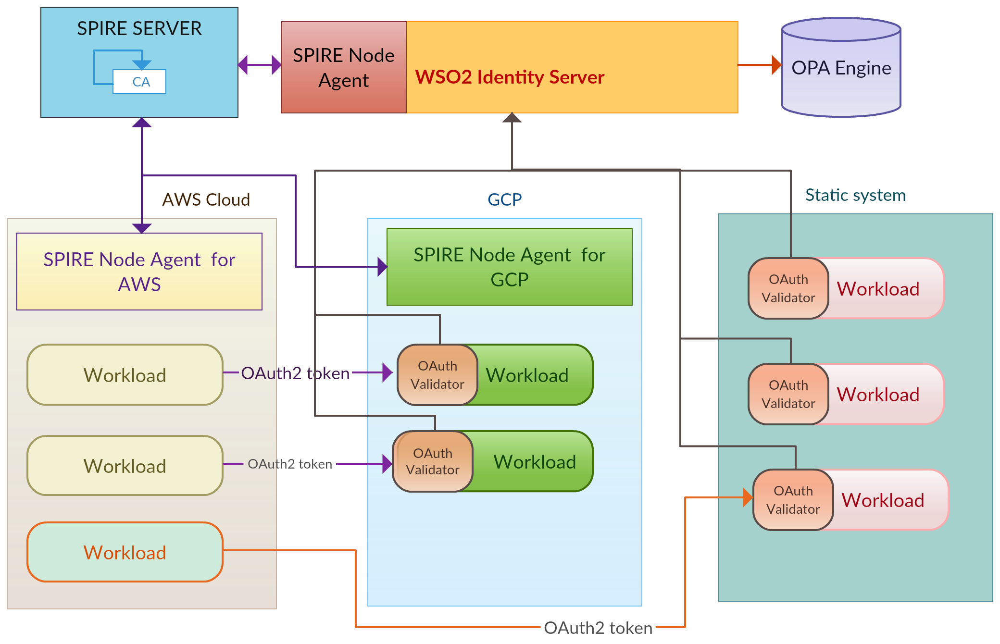
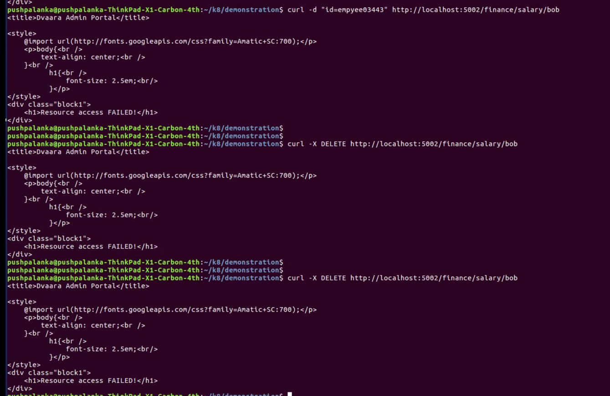

# SPIFFE based KeyStore/TrustStore and OAuth2.0 with WSO2 IS Authorization Server

This demo shows an example using a SPIFFE based KeyStore implemented in the [JAVA-SPIFFE library](https://github.com/spiffe/java-spiffe)
to authenticate workloads and then to authorize those workloads under OAuth 2.0 protocol. This extends the 
[tomcat demo hosted by SPIFEE community](https://github.com/spiffe/spiffe-example/tree/master/java-keystore-tomcat-demo) demonstrated authentication
to be used in OAuth 2.0 MTLS based client authentication to be integrated with the OAuth2.0 based systems.

The SPIFFE KeyStore interacts with the Workload API to fetch asynchronously the SVIDs and handle the certificates in memory. Certificates
updates are pushed by the Workload API before expiration.  

mTLS connections are handled at the tomcat level, that has a connector configured to use a `Spiffe` KeyStoreType. As WSO2 IS also based on tomcat, 
this is used as it is.

This demo is based on SPIRE version 0.6.0.

## Demo scenario 

### Components

This demo is composed of 3 containers 
- spire-server
- wso2-is in host4 with it's spire-agent
- ssh cURL client with it's spire-agent at host2
Below is the ultimate solution we are heading towards.



WSO2 IS has a connector configured to listen on port 9443, to connect with mTLS, using the custom KeyStoreType `Spiffe`.
That KeyStore connects with the Workload API to receive automatically the SVID updates that are used during the handshake
when establishing a TLS connection. It also validates the Peer's SPIFFE ID. 

Tomcat connector: 

```
<Connector
            protocol="org.apache.coyote.http11.Http11NioProtocol"
            port="8443" maxThreads="200"
            scheme="https" secure="true" SSLEnabled="true"
            keystoreFile="" keystorePass=""
            keystoreType="Spiffe"
            clientAuth="want" sslProtocol="TLS"/>
```
We are not enforcing 'clientAuth' with 'true', to allow other clients to connect with WSO2 IS without MTLS.
The trusted SPIFFE ID is configured in the `java.security` file through the `ssl.spiffe.accept`. In the WSO2-IS it looks as follows: 

```
ssl.spiffe.accept=spiffe://example.org/front-end1, spiffe://example.org/front-end2
```

The _ssh-cURL_ in the diagram is a simple cURL app that takes an URL as a parameter and connects over mTLS using 
the SPIFFE Provider. It's used to access any `API` running on the trusted network, specifically to call the oauth2 token endpoint
in this case of WSO2 IS.

The following diagram shows a simplified version of the workloads only, with their SPIFFE IDs and the interactions between
each other: 


#### Registration Entries

| Workload        | Selector      | SPIFFE ID                           | Parent ID                  |
| ----------------| --------------|-------------------------------------| ---------------------------|
| Back-end        | unix:uid:1000 | spiffe://example.org/back-end       | spiffe://example.org/host1 |
| Front-end 2     | unix:uid:1001 | spiffe://example.org/front-end2     | spiffe://example.org/host2 | 
| WSO2-IS         | unix:uid:1002 | spiffe://example.org/wso2-is        | spiffe://example.org/host4 |

In this demo we are only making use of Front-end 2 and WSO2-IS workloads.

### Run the demo

##### Prerequisites

- Linux or macOS
- [Docker](https://docs.docker.com/install/)
- [Docker Compose](https://docs.docker.com/compose/install/)

##### 1. Clone this repo

##### 2. Build and run the docker containers

```
$ make build

Successfully built
```

Run the containers:

```
$ make run

docker-compose up -d
Creating network "spiffeenvoydemo_default" with the default driver
Creating spiffeenvoydemo_spire-server_1 ...
Creating spiffeenvoydemo_spire-server_1 ... done
Creating spiffeenvoydemo_backend_1 ...
Creating javakeystoretomcatdemo_users-service_1
Creating javakeystoretomcatdemo_users-service_1 ... done
Creating spiffeenvoydemo_backend_1 ... done
Creating spiffeenvoydemo_frontend_1 ...
Creating spiffeenvoydemo_frontend_1 ... done
Creating spiffeenvoydemo_wso2is ...
Creating spiffeenvoydemo_wso2is ... done

```

##### 3. Run the SPIRE Server 

On a console run:

```
$ docker-compose exec spire-server ./spire-server run 

INFO[0000] plugins started
INFO[0000] Starting gRPC server                          subsystem_name=endpoints
INFO[0000] Starting HTTP server                          subsystem_name=endpoints 
```

##### 4. Create the workloads entries

On a console run:

```
$ docker-compose exec spire-server ./create-entries.sh

+ ./spire-server entry create -parentID spiffe://example.org/host1 -spiffeID spiffe://example.org/back-end -selector unix:uid:1000 -ttl 120
Entry ID: aed86831-38ec-40f9-bbe5-7bf88f84f788
SPIFFE ID: spiffe://example.org/back-end
Parent ID: spiffe://example.org/host1
TTL: 120
Selector: unix:uid:1000

+ ./spire-server entry create -parentID spiffe://example.org/host2 -spiffeID spiffe://example.org/front-end -selector unix:uid:1000 -ttl 120
Entry ID: 3c1ffb41-cb2f-4393-9eb5-52b17e9cc28e
SPIFFE ID: spiffe://example.org/front-end
Parent ID: spiffe://example.org/host2
TTL: 120
Selector: unix:uid:1000

+ ./spire-server entry create -parentID spiffe://example.org/host2 -spiffeID spiffe://example.org/front-end2 -selector unix:uid:1001 -ttl 120
Entry ID:	6c5c0e0d-e4c1-4022-9c29-1d4a8fc6693c
SPIFFE ID:	spiffe://example.org/front-end2
Parent ID:	spiffe://example.org/host2
TTL:		120
Selector:	unix:uid:1001

+ ./spire-server entry create -parentID spiffe://example.org/host4 -spiffeID spiffe://example.org/wso2-is -selector unix:uid:1002 -ttl 120
Entry ID:	aabc746a-3a68-40ca-cccc-0aa062d12588
SPIFFE ID:	spiffe://example.org/wso2-is
Parent ID:	spiffe://example.org/host4
TTL:		120
Selector:	unix:uid:1002

```

##### 5. Generate Tokens 

###### 5.1 Generate Agent Token for Front-end SSH cURL client and Run the Agent

On the console run:
```
$ docker-compose exec spire-server ./spire-server token generate -spiffeID spiffe://example.org/host2

Token: b0cab4ab-ddcd-4403-862c-325fe599f661
```

Copy the token and run:

```
# docker-compose exec frontend ./spire-agent run -joinToken  {token}

DEBU[0000] Requesting SVID for spiffe://example.org/front-end  subsystem_name=manager
DEBU[0000] Requesting SVID for spiffe://example.org/host2  subsystem_name=manager
INFO[0000] Starting workload API                         subsystem_name=endpoints
```
###### 5.2 Generate Agent Token for Back-end SSH cURL client and Run the Agent

On the console run:
```
$ docker-compose exec spire-server ./spire-server token generate -spiffeID spiffe://example.org/host1

Token: 63274343-ddcd-4403-862c-325fe599fdre
```

Copy the token and run:

```
# docker-compose exec backend ./spire-agent run -joinToken  {token}

DEBU[0000] Requesting SVID for spiffe://example.org/back-end  subsystem_name=manager
DEBU[0000] Requesting SVID for spiffe://example.org/host1  subsystem_name=manager
INFO[0000] Starting workload API                         subsystem_name=endpoints
```

Replace `{token}` by the generated token

##### 6. Test Authorization with OAuth2.0

###### 6.1 Introduce WSO2-IS to SPIRE server

On the console run:
```
$ docker-compose exec spire-server ./spire-server token generate -spiffeID spiffe://example.org/host4

Token: ced63640-d5d4-4d0a-afd5-60617498adde
```
Copy the token and run:

```
$ docker-compose exec wso2is ./spire-agent run -joinToken {token}

DEBU[0000] Requesting SVID for spiffe://example.org/wso2-is  subsystem_name=manager
DEBU[0000] Requesting SVID for spiffe://example.org/host4  subsystem_name=manager
INFO[0000] Starting workload API                         subsystem_name=endpoints
```
Now the SPIRE Agent is running in the host4 and has started the workload API of WSO2 IS.

###### 6.2 Start WSO2 IS
```
$​​docker-compose exec wso2is /opt/wso2-authz/start-wso2.sh

[2019-01-13 14:34:58,697]  INFO {org.wso2.carbon.core.internal.CarbonCoreActivator} -  Starting WSO2 Carbon...
[2019-01-13 14:34:58,698]  INFO {org.wso2.carbon.core.internal.CarbonCoreActivator} -  Operating System : Linux 4.13.0-39-generic, amd64
....

[2019-01-16 13:07:35,461]  INFO {org.wso2.carbon.core.internal.StartupFinalizerServiceComponent} -  WSO2 Carbon started in 69 sec
```
Once the server is started we will try to call the OAuth token endpoint to get a token based on the trust established with MTLS connection.


###### 6.3 Execute cURL to access workload2(employee-dashboard) which will consume workload1(salary-introspection) 
```
$ ​​docker-compose exec frontend bash

# cd /opt/sslCurl/application/

​​#python employees-token.py​
root@c1ecc18d4768:/opt/sslCurl/application# python employees-token.py 
INFO:werkzeug: * Running on http://0.0.0.0:5002/ (Press CTRL+C to quit)
INFO:root:Requesting an oauth2 token...
INFO:root:Bach command:./sslCurl2.sh https://wso2is:9443/oauth2/token grant_type=client_credentials
Apr 13, 2019 2:42:17 PM spiffe.provider.CertificateUtils checkSpiffeId
INFO: SPIFFE ID received Optional[spiffe://example.org/wso2-is]
INFO:root:Token Response: {"access_token":"2fb802a7-daf1-31bf-a067-c8c1e89ad05e","token_type":"Bearer","expires_in":3600}

INFO:root:Token response:2fb802a7-daf1-31bf-a067-c8c1e89ad05e
INFO:requests.packages.urllib3.connectionpool:Starting new HTTP connection (1): backend
DEBUG:requests.packages.urllib3.connectionpool:"GET /finance/salary/bob HTTP/1.1" 401 14
INFO:werkzeug:172.24.0.1 - - [13/Apr/2019 14:42:20] "GET /finance/salary/bob HTTP/1.1" 200 -


In another termincal run the back end
$ ​​docker-compose exec backend bash

# cd /opt/back-end
INFO:root:User Agent: python-requests/2.9.1
INFO:root:Remote Address: 172.24.0.5
INFO:root:OAuth2.0 token: Bearer 2fb802a7-daf1-31bf-a067-c8c1e89ad05e
INFO:root:Endpoint/finance/salary/bob?
INFO:root:Argsbob
INFO:root:MethodPOST
INFO:root:Checking auth...
INFO:root:"dummy#value@method#POST@user_agent#python-requests/2.9.1@remote_addr#172.24.0.5@resource#/finance/salary/bob@user#bob"
Apr 13, 2019 2:43:00 PM spiffe.provider.CertificateUtils checkSpiffeId
INFO: SPIFFE ID received Optional[spiffe://example.org/wso2-is]
INFO:root:command '['bash', '-c', u'./sslCurl2.sh https://wso2is:9443/oauth2/introspect token=2fb802a7-daf1-31bf-a067-c8c1e89ad05e headers=dummy#value@method#POST@user_agent#python-requests/2.9.1@remote_addr#172.24.0.5@resource#/finance/salary/bob@user#bob']' return with response (code 1): {"active":false}

INFO:root:False

Execute below from another terminal to call simulate a call happening in employee-dashboard
curl http://localhost:5002/finance/salary/bob

```
Based on the policy defined in OPA engine, the request will be allowed or denied. This is demoed in the below video.
##### 7. Clean the environment 

Stop the docker containers:

```
$ make clean

docker-compose down
Stopping spiffeenvoysidecar_frontend_1     ... done
Stopping spiffeenvoysidecar_backend_1      ... done
Stopping spiffeenvoysidecar_spire-server_1 ... done
Removing spiffeenvoysidecar_frontend_1     ... done
Removing spiffeenvoysidecar_backend_1      ... done
Removing spiffeenvoysidecar_spire-server_1 ... done
Removing network spiffeenvoysidecar_default
```

### Demo video
[](https://youtu.be/JIqtuP21gMI)

### Dvaara in Detail
[](https://www.slideshare.net/Pushpalanka/authorization-for-workloads-in-a-dynamically-scaling-heterogeneous-system)
